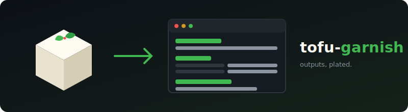

<p align="center">
  
</p>

<p align="center">
  <a href="https://github.com/lowlydba/tofu-garnish/actions/workflows/ci.yml"></a>
  <a href="LICENSE"></a>
  <a href="https://github.com/lowlydba/tofu-garnish/releases"></a>
  <a href="https://docs.zizmor.sh"></a>
  
</p>

# tofu-garnish 🌿

Turn OpenTofu/Terraform outputs into a simple, readable static page on your
repo's GitHub Pages — so engineers can find that ARN without running `tofu
output` or spelunking through state.

Plug-and-play with [dflook/terraform-github-actions][dflook].

---

This README follows the [Diátaxis](https://diataxis.fr/) framework:
[Tutorial](#tutorial) · [How-to guides](#how-to-guides) ·
[Reference](#reference) · [Explanation](#explanation)

## Tutorial

*Publish your Tofu outputs to GitHub Pages in about five minutes.*

### 1. Enable GitHub Pages for your repository

In your repository: **Settings → Pages → Build and deployment → Source →
GitHub Actions**.

### 2. Add a workflow

Create `.github/workflows/publish-outputs.yml`:

```yaml
name: Publish Tofu outputs

on:
  push:
    branches: [main]

permissions: {}

concurrency:
  group: pages
  cancel-in-progress: false

jobs:
  publish:
    runs-on: ubuntu-latest
    environment:
      name: github-pages
      url: ${{ steps.garnish.outputs.page-url }}
    permissions:
      contents: read
      pages: write     # deploy the generated site to GitHub Pages
      id-token: write  # OIDC token for verified Pages deployment
    steps:
      - uses: actions/checkout@v7
        with:
          persist-credentials: false

      - name: Get outputs
        uses: dflook/terraform-output@v2
        id: tf-outputs
        with:
          path: my-terraform-config

      - name: Publish outputs page
        uses: lowlydba/tofu-garnish@v1
        id: garnish
        with:
          outputs-file: ${{ steps.tf-outputs.outputs.json_output_path }}
          title: My Stack Outputs
```

### 3. Push and visit your page

Push to `main`, wait for the workflow to finish, and open the URL shown on
the deployment (also available as the `page-url` action output). You'll see
each output rendered as a card: strings and numbers with a copy button, maps
as key/value tables, and lists of objects as proper columnar tables — one
copy button per row (nested values copy as pretty JSON), and a filter box to
find outputs by name.

That's it. Every push regenerates and redeploys the page.

## How-to guides

### Use it without dflook actions

Pipe `tofu output -json` (or `terraform output -json`) to a file and point
the action at it:

```yaml
      - name: Export outputs
        run: tofu output -json > outputs.json
        working-directory: my-terraform-config

      - uses: lowlydba/tofu-garnish@v1
        with:
          outputs-file: outputs.json
```

Sensitive outputs are automatically masked on the page (see
[Explanation](#sensitive-values)).

### Pass outputs inline instead of a file

Any `dflook/terraform-output` step's outputs can be passed straight through
as JSON — complex values arrive as JSON-encoded strings and are unpacked
automatically:

```yaml
      - uses: lowlydba/tofu-garnish@v1
        with:
          outputs: ${{ toJson(steps.tf-outputs.outputs) }}
```

### Generate the HTML without deploying

Set `deploy: "false"` and do whatever you like with the site directory —
upload it elsewhere, attach it as an artifact, or serve it from another
host:

```yaml
      - uses: lowlydba/tofu-garnish@v1
        id: garnish
        with:
          outputs-file: outputs.json
          deploy: "false"

      - uses: actions/upload-artifact@v4
        with:
          name: outputs-page
          path: ${{ steps.garnish.outputs.site-dir }}
```

### Run the generator locally

The generator is a single stdlib-only Python script — no dependencies to
install:

```console
$ tofu output -json | python3 src/garnish.py --title "My Stack" --output-dir site
garnish: wrote site/index.html (7 outputs)
```

Set `SOURCE_DATE_EPOCH` for a reproducible timestamp.

## Reference

### Action inputs

| Input          | Required | Default             | Description                                                                                                                      |
| -------------- | -------- | ------------------- | -------------------------------------------------------------------------------------------------------------------------------- |
| `outputs-file` | no*      | —                   | Path to a JSON outputs file: the `json_output_path` file from `dflook/terraform-output`, or the output of `tofu output -json`.     |
| `outputs`      | no*      | —                   | Inline JSON string of outputs, e.g. `toJson(steps.<id>.outputs)` from a `dflook/terraform-output` step. Ignored if `outputs-file` is set. |
| `title`        | no       | `Tofu Outputs`      | Title shown on the generated page.                                                                                                 |
| `output-dir`   | no       | `tofu-garnish-site` | Directory the site is written to.                                                                                                  |
| `deploy`       | no       | `"true"`            | Upload the site as a Pages artifact and deploy it. Set `"false"` to only generate HTML.                                            |

\* Exactly one of `outputs-file` or `outputs` must be provided; the action
fails if both are empty.

### Action outputs

| Output     | Description                                                  |
| ---------- | ------------------------------------------------------------ |
| `page-url` | URL of the deployed Pages site (empty when `deploy` is off). |
| `site-dir` | Directory containing the generated `index.html`.             |

### Accepted input formats

Format detection is automatic:

1. **`tofu output -json` / `terraform output -json`** — each output wrapped
   in `{"value": …, "type": …, "sensitive": …}`. Sensitive outputs are
   masked.
2. **Plain map** — `{"name": value, …}`, as written by the
   `json_output_path` file from `dflook/terraform-output`.
3. **String map** — `{"name": "value-or-JSON-string", …}`, as produced by
   `toJson(steps.<id>.outputs)`. Strings that look like JSON arrays/objects
   are decoded; primitive strings are left untouched.

### Workflow requirements (when deploying)

* GitHub Pages source set to **GitHub Actions**.
* Job permissions: `pages: write` and `id-token: write`.
* Job environment: `github-pages` (recommended).
* A `concurrency` group when multiple workflows may deploy Pages.

### CLI reference

```text
usage: garnish [-h] [--input INPUT] [--output-dir OUTPUT_DIR] [--title TITLE] [--version]

--input       Path to a JSON outputs file, or '-' for stdin (default).
--output-dir  Directory to write index.html into (default: site).
--title       Page title (default: 'Tofu Outputs').
```

Exit codes: `0` success, `2` bad input (missing file, invalid JSON, or
non-object top level).

## Explanation

### Why does this exist?

Complex, dynamic Tofu configurations are great for platform teams and
terrible as a lookup surface. When an application engineer just needs the
queue ARN or the VPC ID, "clone the repo, init the backend, run
`tofu output`" is a lot of ceremony. tofu-garnish gives outputs a stable,
human-readable URL that is regenerated on every apply.

### Why not just publish the JSON?

Raw `output -json` is noisy: values are buried in `value`/`type`/`sensitive`
wrappers, nested objects become walls of braces, and nothing is scannable.
tofu-garnish flattens that into structure-aware HTML: maps become key/value
tables, lists of similar objects become columnar tables (one row per subnet,
one column per attribute), and every top-level row gets a single copy button
— plain text for scalars, pretty JSON for anything nested. It's
deliberately KISS — one self-contained HTML file, no framework, no build
step, dark-mode via `prefers-color-scheme`, and a few lines of vanilla JS
for filtering and copying.

### <a name="sensitive-values"></a>How are sensitive values handled?

When the input is in `output -json` format, any output flagged
`"sensitive": true` is rendered as a masked placeholder — the value never
reaches the HTML. **Caveat:** the other two input formats carry no
sensitivity metadata, so tofu-garnish cannot know what to mask; and either
way, your Pages site is as public as your repo. Don't publish outputs you
wouldn't commit to the README.

### Security posture

The action is a composite of a stdlib-only Python script plus the official
`actions/upload-pages-artifact` and `actions/deploy-pages` actions, all
pinned to full commit SHAs. All user-controlled values are passed through
environment variables (never interpolated into shell), and all rendered
content is HTML-escaped. CI runs [zizmor][zizmor] with the **pedantic**
persona over every workflow and the action itself.

## Development

```console
$ pip install pytest pytest-cov ruff
$ python -m pytest --cov      # tests + coverage gate
$ ruff check . && ruff format --check .
$ zizmor --persona pedantic . # security audit
```

## License

[MIT](LICENSE)

[dflook]: https://github.com/dflook/terraform-github-actions
[zizmor]: https://docs.zizmor.sh
